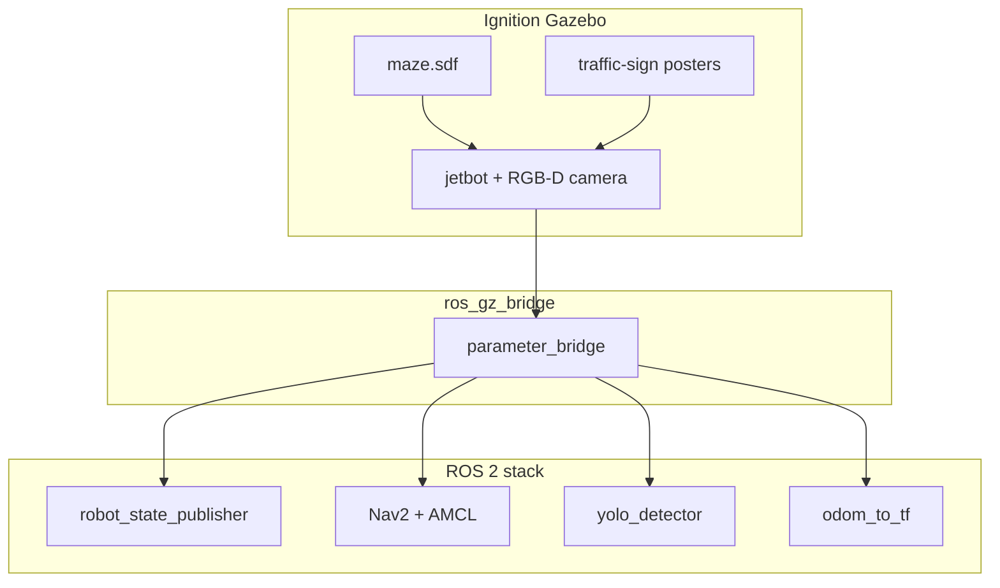

<div align="center">

# Cognitive Robotics — Group Coursework

### Simulated Jetbot navigation with traffic-sign perception

[](https://docs.ros.org/en/humble/)
[](https://gazebosim.org/)
[](https://navigation.ros.org/)
[](https://github.com/ultralytics/ultralytics)
[](https://isocpp.org/)
[](https://www.python.org/)

<br/>

[](https://www.ntu.ac.uk/)
[]()
[]()

<br/>

[](https://github.com/hackerbotfz/Cognitive-CW/commits)
[](https://github.com/hackerbotfz/Cognitive-CW)
[](https://github.com/hackerbotfz/Cognitive-CW/stargazers)

<br/>

**[Faiz Lawan](https://github.com/hackerbotfz)**

</div>

---

ROS 2 workspace for an NTU cognitive robotics group project: a **Jetbot** robot in an **Ignition Gazebo** maze with **Nav2** autonomous navigation, **AMCL** localisation, and a **YOLO** node for detecting stop / slow / fast traffic-sign posters on the walls.

## Packages

| Package | Role |
|---------|------|
| **ntu_robotsim** | Worlds, models, bridges, Nav2 launch files, YOLO detector node |
| **odom_to_tf_ros2** | Publishes `odom` → `tf` for the simulated robot frame |

## Architecture



## Workspace layout

```
Cognitive_CW/
├── src/
│   ├── ntu_robotsim/       # simulation, navigation, perception
│   └── odom_to_tf_ros2/    # odometry TF helper
├── requirements.txt        # Python deps for YOLO node
└── README.md
```

## Build

```bash
cd Cognitive_CW
pip install -r requirements.txt
colcon build --symlink-install
source install/setup.bash
```

Trained weights ship as `src/ntu_robotsim/models/best.pt.gz` (Git LFS). After clone: `git lfs pull`. The detector decompresses them on first run. Without LFS or weights, it falls back to `yolov8n.pt`.

To add or refresh weights from a local `best.pt`:

```bash
python scripts/compress_model.py
git add src/ntu_robotsim/models/best.pt.gz
git commit -m "Add trained YOLO weights"
```

## Run

**Maze simulation**

```bash
ros2 launch ntu_robotsim maze.launch.py
```

**Robot + ROS ↔ Gazebo bridge**

```bash
ros2 launch ntu_robotsim single_robot_sim.launch.py
```

**Navigation (Nav2 + RViz)**

```bash
ros2 launch ntu_robotsim navigation.launch.py
```

**Traffic-sign detection**

```bash
ros2 run ntu_robotsim yolo_detector.py
```

**Odometry TF**

```bash
ros2 launch odom_to_tf_ros2 atlas_odom_to_tf.launch.py
```

## License

[LICENSE](LICENSE) (Apache-2.0) · [NOTICE](NOTICE) · `odom_to_tf_ros2`: [BSD 3-Clause](src/odom_to_tf_ros2/LICENSE)
